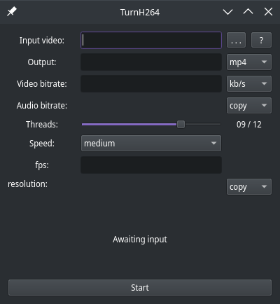
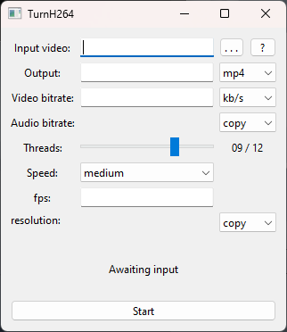

# TurnH264: A simple GUI program that converts video into H264 using FFmpeg.

<p align=center>

5

</p>

---

## How to run from source:

Install PySide6: `pip install PySide6`

if it's not globally installed, Place an `ffmpeg` executable in the same directory as `TurnH264.py`

FFmpeg builds are available at https://www.ffmpeg.org/download.html.

Everything should work as intended.

### for MacOS users:

Please do note that this program is untested for macOS as neither me nor any of my friends have Apple hardware, though since it's a single script it should work fine as long as you have the required dependencies.

---

## Compilation:
**DISCLAIMER: compilation is unnecessary to run this program.**

These commands must run on the OS that you want to compile for.

Simple: run `python compile.py`

otherwise:

```bash
  pip install pyinstaller pyside6
  pyinstaller TurnH264.py
```
---

### Todo:

-   [x] Add a progress bar
-   [x] automatically install ffmpeg if not detected
-   [ ] NVENC and VCE

---

My fork was developed alongside this master branch during pre-release hence the large differences in code.
